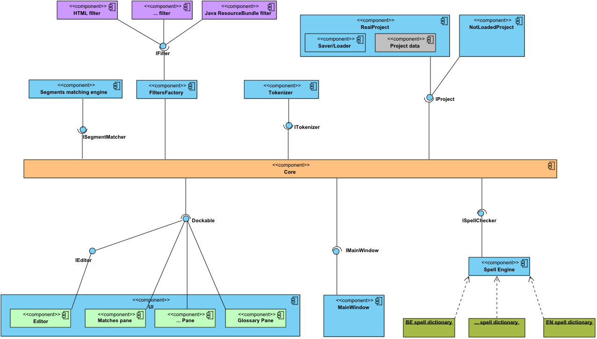
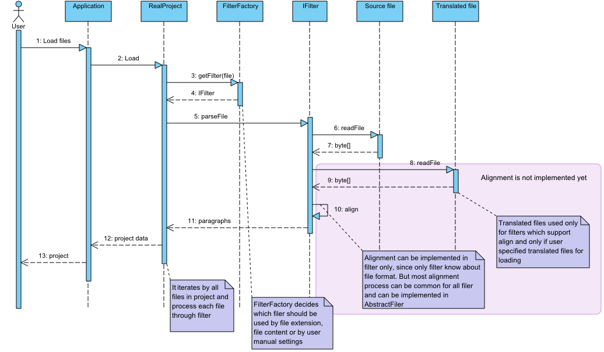
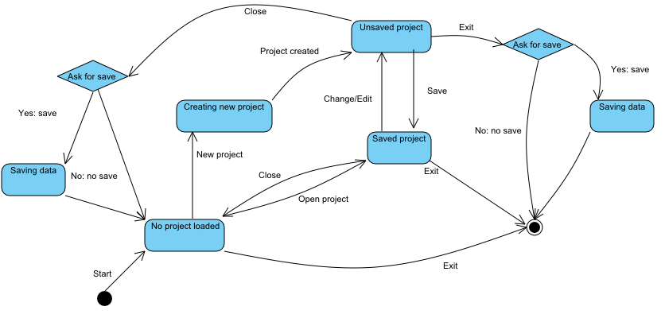

# OmegaT Developer's guide

## OmegaT architecture

Components in OmegaT:



Each component must implement a specific interface, and only this interface should be used to call this component from other components. 

## Threads usage


OmegaT uses standard thread behavior, i.e., short term (i.e., most of them) operations should be executed in the UI thread (event dispatcher thread). Only long-term tasks should create a new thread using SwingWorker. All these (long-term) tasks lock the OmegaT UI to prevent the user to change anything in application.
There is only one “real” thread — it's SaveThread, which saves the project every 10 minutes.

## Components

All components accessible from Core class static methods.

### IMainWindow

This component controls the main application frame and can make some basic operations, like locking/unlocking the UI and displaying messages and errors.

### IEditor

This is the editor of translations. The application must have only one editor, but theoretically the user can switch between different editor implementations without project reloading.

### IProject

Interface for the currently loaded project. There are two implementation classes: RealProject and NotLoadedProject. The RealProject instance is created when a project is loaded, i.e., if the user clicks on “Open Project”, then the first instance will be created, when the user clicks on “Close Project” and “Open Project” again, the second instance will be created. All project data are stored in this class.

### IMatcher

Panel that find matches in other translations and TM files.

### ITagValidation

Tag validator, that checks tags in all translations and show invalid tags.

### ITokenizer

It can split segments on tokens for spell checking and to find matches.

### ISpellChecker

Spell checker for translation.

## Events

Each component can listen to application events. To register listeners, component should call CoreEvents.register... methods. Events can be:

### IProjectEventListener

- onProjectChanged(PROJECT_CHANGE_TYPE), where PROJECT_CHANGE_TYPE is enum {CLOSE, COMPILE, CREATE, LOAD, SAVE}
  - Project changed, i.e., when the user closes a project, or compile, create, load, or save it.

### IEntryEventListener

- onNewFile(String activeFileName)
  - User changes the current file in the editor.
- onEntryActivated(StringEntry newEntry)
  - User change current entry in editor.

### IFontChangedEventListener

- onFontChanged(Font newFont)
  - User change application font.
  
Event listeners are executed only in the UI (Swing event dispatcher) thread by the “invokeLater” method.

Event listening is the preferred way to handle project open/close and entry change for components, since the list of components can be large, and the application cannot know anything about user-defined components.

##  Filters

OmegaT has many classes to parse (and build) translation files. It supports many formats, such as *.po, *.properties, *.html, etc. A class to parse one format is named a “Filter”. There is a FilterMaster, which organizes all filters and can detect which filter should be executed for a specific file format.

Filter is a class that can:

  - Read the document in a given format
  - Extract the translatable content out of it
  - Write the document in the same format, replacing translatable content with its translation 

Note that filters must be two-fold: read & write, reading and writing the same format. Responsibility for such behavior is of course up to the file filter programmer.

There's a correspondence between a file filter and a file format it handles: only one instance of the file filter is instantiated for a single file format.

Two possible options for handling similar file formats:

  - The same file filter instance handles all the similar formats. For example, the Open Office file filter handles all the file formats of Open Office suite.
  - A single file filter class may be instantiated with different parameters. For example, the text file filter is instantiated with different encoding to handle text files coming with different character sets. 

While there are many file filters, there's a need to distinguish what source files are handled by what filter. Currently (OmegaT version 2.0), we distinguish files by extension, and by content, but a more sophisticated mechanism should be invented, and more control over the process should be given both to the filter itself and to the user.

###  Details on patterns

Input filename pattern resembles DOS filename pattern:

    - *.txt means all files with "txt" extension
    - read* means all the files that start with "read", for example "readme" 

#### Output filename pattern is more complex.

It may consist of normal characters and some substituted variables. They have the format ${variableName} and are case insensitive.

The following variables exist:

      - ${filename} - full filename of the input file, both name and extension (default)
      - ${nameOnly} - only the name of the input file without extension part
      - ${extension} - the extension of the input file
      - ${sourceLanguage} - the source language of the project
      - ${targetLanguage} - the target language of the project

Most file filters will use default “${filename}”, that leads to the name of translated file being the same as the name of source file. But, for example, the Java Resource Bundles file filter will have the pattern equal to “${nameonly}_${targetlanguage}.${extension}”.

###  XML processing

#### How it looks.

1) All non-paragraph tags and its content should be translated. Paragraph tags just declare new paragraph, but don't say anything about translated and untranslated parts of XML. By default, everything is translatable. When you want to indicate that something should not be translated you declare an "intact" tag.
2) If tags (both tags for paired tags) are before or after any text in paragraph - they will be skipped. Spaces are not considered as text. For example:

>   "  <a>  </a>  text" - "  <a>  </a>  " will be skipped. "  <a> text1 </a> text2" - if one tag from paired tags is 
>      inside text - other tag will not be skipped. "  <a>   text </a> " - spaces and tags will be skipped

#### How it works.

1) Handler.java collects all tags and texts. If it finds a paragraph tag, then it calls translateAndFlush(). Collected tags can be unbalanced, i.e. ```<a> <b> text</b>```.

2) ```Entry.detectTags()``` is executed for define parts that will be translated.

3) It finds first(textStart) and last(textEnd) text elements. Spaces-only elements are skipped.

4) Then it tries to expand first(firstGood) and last(lastGood) markers for tags that have paired tags inside textStart/textEnd.

5) OmegaT 3.0 works with tags as described before, but there are 2 new options: "Remove leading and trailing tags" and "Remove leading and trailing whitespace in non-segmented projects". By default, these options are enabled, i.e., it works as OmegaT 2.6. If one of these options are disabled, then OmegaT just expand firstGood and lastGood to all tags or whitespaces in Entry.

6) OmegaT 3.0 also contains content-based tags functionality. Since OmegaT shouldn't skip content-based tags, Entry.detectTags() expands textStart/textEnd to content-based tags that are paired to tags inside text.

#### Spaces processing.

There is one non-obvious thing about leading and trail spaces processing in XML filters(and TMXReader). XML text can be formatted and unformatted.

Unformatted XML. Usually, if data is stored in unformatted XML, there is no issue with leading/trailing spaces because OmegaT can just read  these spaces and be used with “Remove leading and trailing whitespace in non-segmented projects” option disabled.

Formatted XML. In case of formatted XML, it's impossible to distinguish spaces for formatting and real leading/trailing spaces. I.e., option “Remove leading and trailing whitespace in non-segmented projects” should be enabled.

By the way, TMXReader2/TMXWriter2 use a mix of formatted/unformatted XML: segments's text inside <seg> tags are unformatted, but all other tags are formatted. It allows to have nice looking XML, but without leading/trailing spaces issue. As result, it was impossible to create project_save.tmx by standard JAXB processing. TMXReader2/TMXWriter2 use XMLEventReader/XMLStreamWriter for process XML.

## Plugins

OmegaT can use external plugins for additional functionality.

A plugin is just a .jar file, which is stored in “<OMEGAT_INSTALLATION>/plugins/” dir or “<OMEGAT_USERPREFERENCES>/plugins/. If a plugin needs to use additional jars, they can be placed in the same directory.

There must be a manifest file that indicates that it is an OmegaT plugin. There are two flavors, see below. Omegat 5.3.0 also supports to provide additional information that can be displayed in the UI. You can optionally provide name, version, author and description. For each there are different manifest entry alternatives, and OmegaT will pick the first one present in the order from left to right as described in the table below:

| Attribute | Manifest entry (pick one) |
| :-------- |:--------------------------|
| Name |Plugin-Name, Bundle-Name, Implementation-Title |
| Version | Plugin-Version, Bundle-Version, Implementation-Version |
| Author | Plugin-Author, Implementation-Vendor, Built-By |
| Description | Plugin-Description |


### Plugins for OmegaT 2.1.3 and up:

A plugin should be declared in META-INF/MANIFEST.MF:

```properties

OmegaT-Plugin: true
Plugin-Name: …
Plugin-Version: x.y.z
Plugin-Author: …
Plugin-Description: …

Name: my.Class
OmegaT-Plugin: <type>

Name: my.other.Class
OmegaT-Plugin: <type>
```

```<type>``` can be ‘filter’, ‘tokenizer’, ’marker’, ’machinetranslator’, ‘base’ (since v2.5.0), ‘glossary’ (since 2.5.0 update 3) and is case insensitive.

See also the [How to create filter Plugin](4.2.HowToCreateFilterPlugin.md) document.

###	Plugins for OmegaT 3.0.1 and up:

A plugin should be declared in META-INF/MANIFEST.MF:

```properties

Plugin-Name: …
Plugin-Version: x.y.z
Plugin-Author: …
Plugin-Description: …
OmegaT-Plugins: <classname>
```

where classname is the fully qualified classname of the plugin's initialization class. Multiple classnames can be defined, like in “Class-Path” attribute, i.e., space separated.

This class should contains the following methods:

```java
class SomePlugin {
  public static void loadPlugins() {
  }

  public static void unloadPlugins() {
  }
}
```

The ```loadPlugins()``` method is executed on application startup before any GUI initialization.
The plugin initialization class should analyze OmegaT version and register classes for filters,
markers, etc.:

```java
class SomePlugin {
  public static void loadPlugins() {
    Core.registerFilterClass(MyFilter.class);
  }
}
```

Also, the initialization class can register its own event handlers, for example, for GUI initialization on application startup:

```java
class SomePluginImpl {
  public void addEventHanlder() {
    CoreEvents.registerApplicationEventListener(...);
  }
}
```

The loadPlugins() method should check OmegaT version, or existing interface, or other things required for plugin execution. If the plugin cannot be loaded, it can send some error message which will be displayed to the user after GUI initialization:

```java
      Core.pluginLoadingError(“Some message”);
```

Since the plugin is likely to use some OmegaT classes, which can be changed in a future OmegaT version,
we recommend to separate plugin initialization class and plugin implementation class.
Also, it will be better to do not use any other classes (except Core and CoreEvents) 
in import declarations of the plugin initialization class.

In this case, the plugin initialization class can catch loading errors and send error message.
Usually, the loadPlugin() method should looks like:


```java
class SomePlugin {
  public static void loadPlugins() {
      try {
          // ... analyze OmegaT version …
          if (supportedVersion) {
              // ... register classes and events ...
          }
      } catch(Throwable ex) {
          Core.pluginLoadingError(“Plugin … cannot be loaded because this version of OmegaT is not supported”);
      }
  }
}
```

The ```loadPlugins()``` method shouldn't execute any long operations.
The ```unloadPlugins()``` method is executed on application shutdown. 
Usually, it should be just an empty method, but it can be used to free some resources.

## Additional Extension Points

In addition to the Core.registerFooClass() methods, the following extension points are available. They are only available after GUI initialization, so registration of custom implementations should take place in IApplicationEventListener.onApplicationStartup() (see CoreEvents.registerApplicationEventListener()).

### IGlossary

Provides glossary results e.g. for display in the Glossary pane. Register implementations with Core.getGlossaryManager().addGlossaryProvider().

### IDictionaryFactory, IDictionary

Provides dictionary results e.g. for display in the Dictionary pane. IDictionaryFactory implements support for a dictionary file format, while IDictionary represents a loaded instance. Register implementations of IDictionaryFactory with Core.getDictionaries().addDictionaryFactory().

### AbstractAutoCompleterView (AutoCompleter{List,Table}View)

Provides auto-completer (input assistance) suggestions. Extend either AutoCompleterListView or AutoCompleterTableView if suggestions should be shown as a list or a table, or AbstractAutoCompleterView to implement a new UI. Register implementations with Core.getEditor().getAutoCompleter().addView().

## Project details

Sequence diagram for loading a project:



Application states by project:



## Appendix A. Known external plugins

A list of plugins can be found online: https://sourceforge.net/p/omegat/wiki/Plugins/

## License and terms

<pre>
 OmegaT - Computer Assisted Translation (CAT) tool 
          with fuzzy matching, translation memory, keyword search, 
          glossaries, and translation leveraging into updated projects.

 Copyright (C) 2005-2008 Maxym Mykhalchuk and Alex Buloichik
               2013 Alex Buloichik, Didier Briel
               2014-2016 Didier Briel
               2022 Hiroshi Miura
               Home page: http://www.omegat.org/
               Support center: http://groups.yahoo.com/group/OmegaT/

 This file is part of OmegaT.

 OmegaT is free software: you can redistribute it and/or modify
 it under the terms of the GNU General Public License as published by
 the Free Software Foundation, either version 3 of the License, or
 (at your option) any later version.

 OmegaT is distributed in the hope that it will be useful,
 but WITHOUT ANY WARRANTY; without even the implied warranty of
 MERCHANTABILITY or FITNESS FOR A PARTICULAR PURPOSE.  See the
 GNU General Public License for more details.

 You should have received a copy of the GNU General Public License
 along with this program.  If not, see <http://www.gnu.org/licenses/>.
</pre>

In the specific context of this document (“OmegaT's developer's guide”), “source code” is to be understood as the 
text of this document itself (independently of the document format used), as well as the images, either in the 
binary version contained inside this document, or as the .vpp files used to create these images.
